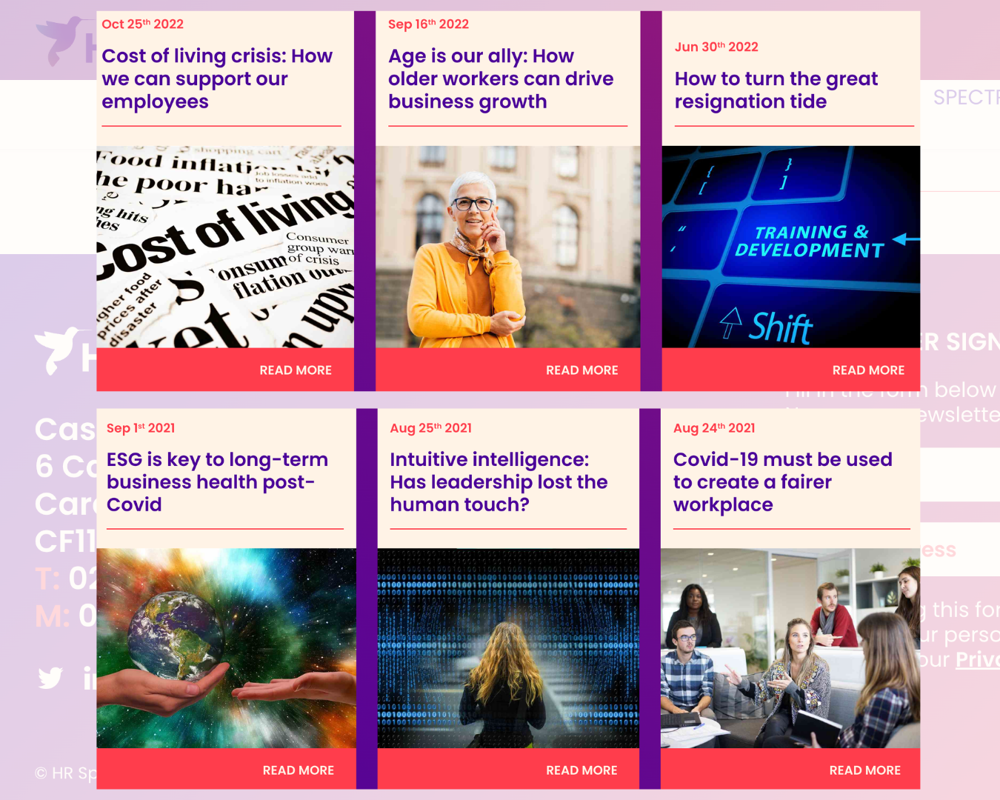
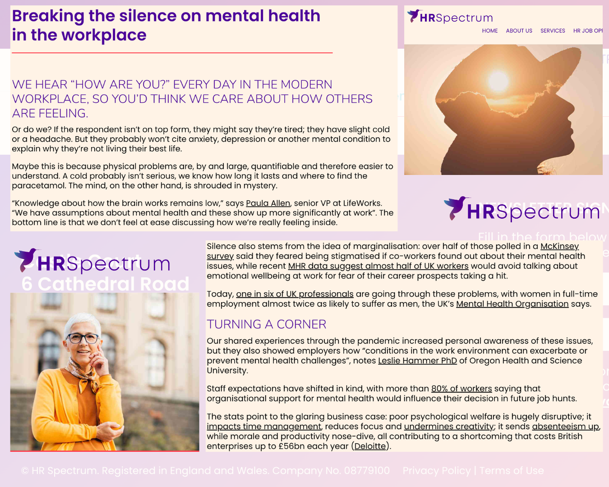
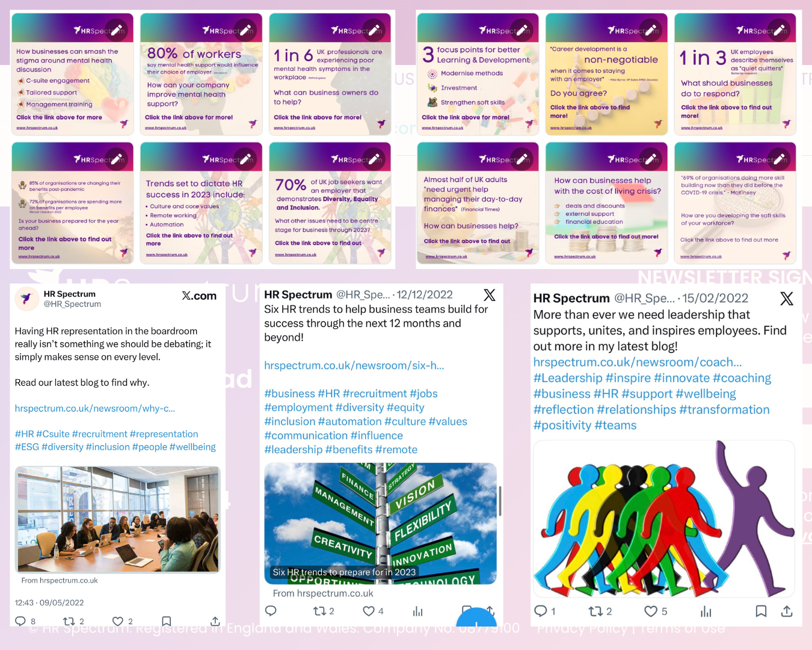
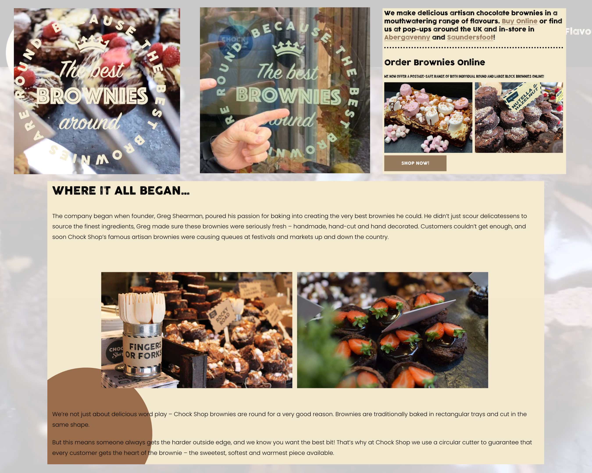
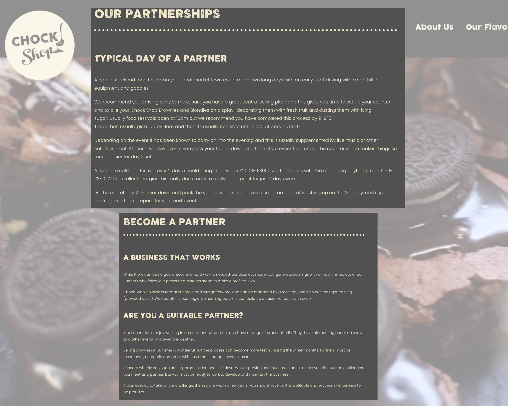
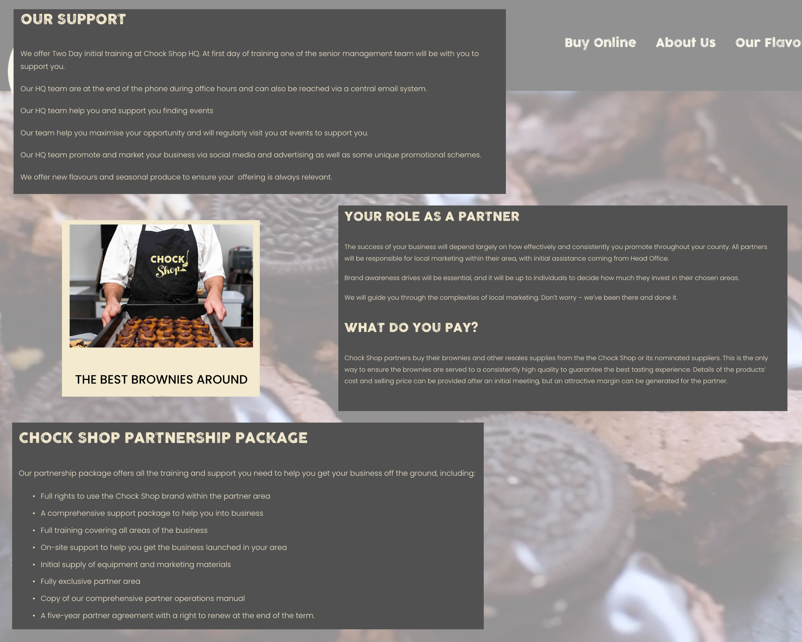

# Commercial Copywriting
NB: All content pre-AI.

Commercial copywriting for private clients through [Skybluecreative](https://skybluecreative.co.uk/), including website copy, blog posts, PR, product descriptions, ghostwriting, and proofreading.

## Website Copywriting

## HR Spectrum
[HR Spectrum](https://hrspectrum.co.uk/) is a Wales-based boutique HR recruitment consultancy that connects organisations with high-calibre HR professionals, combining market insight, personalised service, and long-term partnership. Website design by [Parade Design](https://paradedesign.co.uk/).

### Brief
- Develop clear, engaging website copy for an HR and recruitment audience  
- Communicate job opportunities, services, and employer value propositions effectively  
- Produce timely newsroom/blog content to support ongoing engagement
- Translate complex HR topics into accessible, business-friendly language
- Support social media messaging with appropriate images and organise distribution
- Ensure consistency of tone across website, CMS, and social channels

### Webcopy

### Blogs
Blogs for the [HR Spectrum](https://hrspectrum.co.uk/) website covered employment law, workplace wellbeing and HR best practice. A total of 22 original, researched, on-topic HR blogs were supplied according to regular briefings with client from Aug 2021 to Feb 2023, each with banner image. A snapshot of these blogs as they appear in the [HR Spectrum Newsroom](https://hrspectrum.co.uk/newsroom) can be seen below. My work ends on and includes entry dated Feb 20th 2023.

Example Blog: Breaking the silence on mental health in the workplace. Read the blog in the [HR Spectrum Newsroom](https://hrspectrum.co.uk/newsroom/breaking-the-silence-on-mental-health-in-the-workplace).

Full blog list written for [HR Spectrum](https://hrspectrum.co.uk/):

- [Covid-19 must be used to create a fairer workplace](https://hrspectrum.co.uk/newsroom/covid-19-must-be-used-to-create-greater-gender-equality-in-the-workplace)

- [Intuitive intelligence: Has leadership lost the human touch?](https://hrspectrum.co.uk/newsroom/intuitive-intelligence-in-leadership)

- [ESG is key to long-term business health post-Covid](https://hrspectrum.co.uk/newsroom/esg-and-sustainability-are-crucial-for-business)

- [Care at the core of post-pandemic workplace success](https://hrspectrum.co.uk/newsroom/care-is-key-to-post-pandemic-workplace-success)

- [Progress on pregnancy: Are we turning a corner?](https://hrspectrum.co.uk/newsroom/are-we-making-progress-on-pregnancy-in-the-workplace)

- [What makes a great business leader?](https://hrspectrum.co.uk/newsroom/what-makes-a-great-business-leader)

- [New Year, New Us: Celebrate the season and prepare for business growth](https://hrspectrum.co.uk/newsroom/how-to-celebrate-christmas-and-build-your-team-for-the-new-year)

- [New Year trends: What’s on the HR horizon for 2022?](https://hrspectrum.co.uk/newsroom/hr-trends-for-2022)

- [How coaching sheds light on the full spectrum of leadership](https://hrspectrum.co.uk/newsroom/coaching-competencies-within-influential-leadership)

- [Does your company need a Head of Remote?](https://hrspectrum.co.uk/newsroom/head-of-remote-working)

- [Attracting the best talent in the post-pandemic world](https://hrspectrum.co.uk/newsroom/how-to-attract-the-best-talent-to-your-business)

- [Just how important is flexible working to today’s job seekers?](https://hrspectrum.co.uk/newsroom/what-makes-a-flexible-working-lifestyle)

- [Hear, hear: Listening is the star of the CEO skill set](https://hrspectrum.co.uk/newsroom/hear-hear-why-listening-is-the-star-of-the-ceo-skill-set)

- [Why HR needs a seat in the C-suite](https://hrspectrum.co.uk/newsroom/why-companies-need-hr-in-the-c-suite)

- [“Soft” skills are paramount for post-Covid rebuild](https://hrspectrum.co.uk/newsroom/the-business-value-of-soft-skills)

- [How to turn the great resignation tide](https://hrspectrum.co.uk/newsroom/staff-training-and-development)

- [Age is our ally: How older workers can drive business growth](https://hrspectrum.co.uk/newsroom/how-to-attract-older-workers)

- [Cost of living crisis: How we can support our employees](https://hrspectrum.co.uk/newsroom/cost-of-living-crisis-how-we-can-support-our-employees)

- [Six HR trends to prepare for in 2023](https://hrspectrum.co.uk/newsroom/six-hr-trends-to-prepare-for-in-2023)

- [Cost-effective tips to spread the cheer this Christmas](https://hrspectrum.co.uk/newsroom/cost-effective-tips-to-spread-the-cheer-this-christmas)

- [Why learning and development is crucial, and how your business can improve](https://hrspectrum.co.uk/newsroom/improve-learning-and-development)

- [Breaking the silence on mental health in the workplace](https://hrspectrum.co.uk/newsroom/breaking-the-silence-on-mental-health-in-the-workplace)

### Infographics
A snapshot of infographics that I designed, wrote, scheduled and published as part of social media messaging campaigns on LinkedIn, Facebook, and X for [HR Spectrum](https://hrspectrum.co.uk/). This content was produced to promote and support blogs, events, campaigns and announcements, such as job or training opportunities.

## Chock Shop
[Chock Shop](https://www.chockshop.co.uk/) is a UK-based artisan brownie brand known for its handmade, premium products and strong presence at festivals, markets, and two retail locations, including Abergavenny and Saundersfoot in Wales.

### Brief
- Develop engaging, appetite-driven copy
- Reflect playful, indulgent brand voice
- Develop 30 product descriptions
- Emphasise quality + uniqueness (round brownies, fresh, handmade)

### Webcopy
I developed the full suite of website copy for [Chock Shop](https://www.chockshop.co.uk/), shaping a tone that balances indulgence, fun and clarity. The focus was on capturing the brand’s personality while clearly communicating product quality and general scrumptiousness.

Part of [Chock Shop](https://www.chockshop.co.uk/) brownies' idenity was their shape - round instead of the conventional square. I incorporated this into the slogan that I wrote for [Chock Shop](https://www.chockshop.co.uk/): "THE BEST BROWNIES AROUND BECAUSE THE BEST BROWNIES ARE ROUND". Beyond the website this can be seen on the windows of [Chock Shop](https://www.chockshop.co.uk/) outlets, as pictured below.

### Blogs
I wrote long-form blog content designed to extend the brand voice beyond product pages, combining storytelling with SEO. Below is an example blog, and an interview that I conducted with [Chock Shop](https://www.chockshop.co.uk/) franchisees. 

### Product Description
I wrote over 30 product descriptions for the [Chock Shop menu](https://www.chockshop.co.uk/our-flavours). See a snap shot below.

## HUBXV
HUB XV was a start-up UK-based coworking and business community founded by former Wales international rugby player Alix Popham. It transformed iconic sports venues into flexible workspaces for professionals and entrepreneurs. The business is no longer in operation.

### Brief

- Develop and deliver a consistent brand voice across all channels, including website, marketing, PR, social media, and editorial content.  
- Produce engaging content—blogs, interviews, and news releases—to build brand identity, support community engagement, and promote the HUB XV concept.

### Webcopy

### PR

### 

## Chapter Court, Wrexham
[Chapter Court](https://chaptercourt.co.uk/) is a microretailing and events space in the heart of Wrexham.

### Brief
- Develop engaging website copy to introduce a micro-retail destination and communicate its offer to visitors and prospective traders.  
- Capture a clear, community-focused tone while highlighting the diversity of independent businesses within the space.

### Webcopy
Document design by [Parade Design](https://paradedesign.co.uk/).

.

